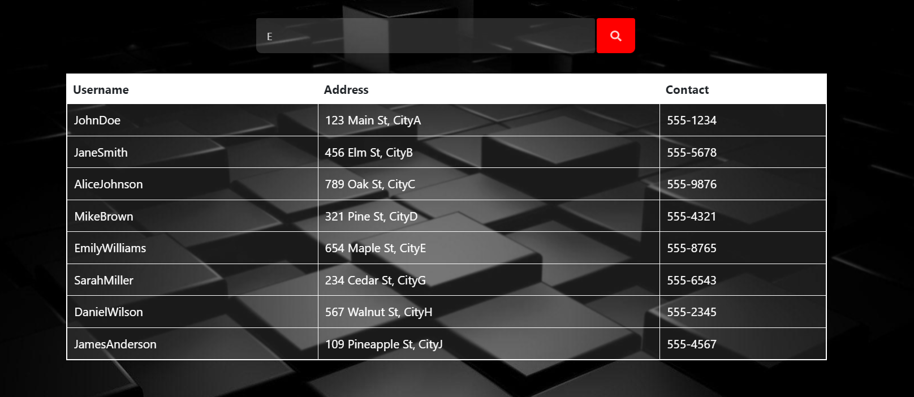

#### Assignment1
Create a search HTML page by linking google search using inline, external and internal(tags)

#### Assignment1_Revision
[Click here to watch video👉](https://www.youtube.com/watch?v=BwtNi2mpe5w)


#### Assignment2
Html Tags, HTML5 tags and tables, HTML Form Elements

#### Assignment3 
Clock Js


#### Assignment4
Form Validation 


#### Assignment6
Form validation with Php and MySQL database <br>
Note: Change the table_name to your own table in MySQL database
```
<!-- home.php -->
$select_query = "SELECT * FROM ==table_name== WHERE name = :username AND password = :password";
<!-- signup.php -->
$insert_query = "INSERT INTO ==table_name==(name, password, address) VALUES (:username, :password, :address)";
```

#### Assignment7
Ajax Search 

```
<!-- server.php -->
$select_query = "SELECT username, address, contact FROM table_name WHERE username LIKE '%".$_GET['search']."%'";
```