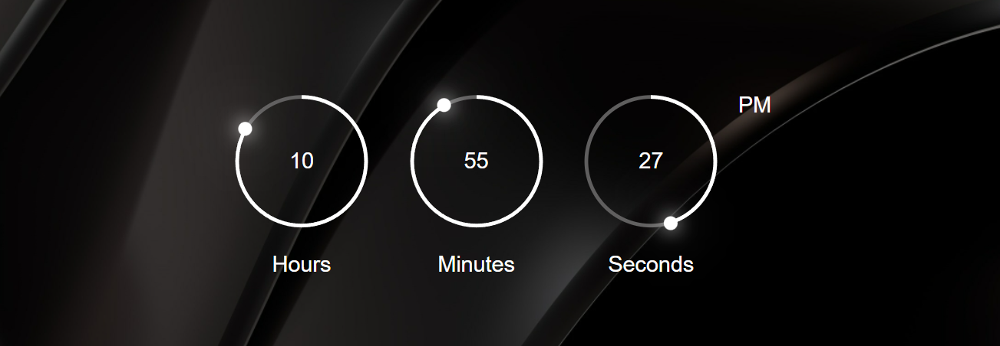

#### Assignment1
Create a search HTML page by linking google search using inline, external and internal(tags)

#### Assignment1_Revision
[Click here to watch video👉](https://www.youtube.com/watch?v=BwtNi2mpe5w)

#### Assignment2
Html Tags, HTML5 tags and tables, HTML Form Elements

#### Assignment3 
Clock Js

#### Assignment4
Form Validation 

